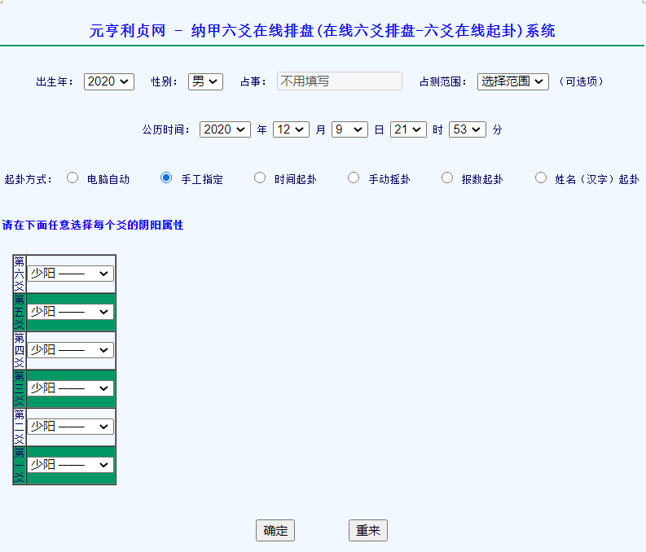

# 排盘系统

# 产品需求说明书

| 文件状态：     | [√ ] 草稿  [  ] 正式发布  [] 正在修改 |
| -------------- | ------------------------------------- |
| **文件标识：** | 排盘系统                              |
| **当前版本：** | 1.0                                   |
| **作    者：** | 归愿                                  |
| **完成日期：** |                                       |

**版 本 历 史**

| **版本/状态** | **作者** | **参与者** | **起止日期**   | **备注** |
| ------------- | -------- | ---------- | -------------- | -------- |
| 草稿：1.0     | 归愿     |            | 2020年12月9日~ | 新建     |
|               |          |            |                |          |
|               |          |            |                |          |

## 一、文档介绍

### 1.文档目的

本文档主要针对排盘系统的使用环境与功能提出具体的要求，同时它还将作为该产品设计与开发的重要参考依据。

### 2.文档范围

本文档包含以下几部分：

1. 产品介绍

2. 产品面向的用户群体

3. 产品应当遵循的标准或规范

4. 产品的范围

5. 产品中的角色

4. 产品的功能性需求

5. 产品的非功能性需求

6. 需求确认	

### 3.读者对象

本文档的读者范围包括：

1.	需求提供方具体责任人

2.	开发方的项目经理、系统分析设计人员、测试人员

### 4.参考文档

**提示：**列出本文档的所有参考文献（可以是非正式出版物），格式如下：

[标识符] 作者，文献名称，出版单位（或归属单位），日期

**例如：**

[SPP-PROC-PP] SEPG，需求开发规范，机构名称，日期

### 5.术语与缩写解释

| **缩写、术语及符号** | **解 释** |
| -------------------- | --------- |
|                      |           |
|                      |           |
|                      |           |
|                      |           |

## 二、产品介绍

排盘系统主要是提供易学术数学习者更好的学习体验，帮助用户更快熟悉学习术数；

## 三、产品面向的用户群体

需要术数排盘的用户

## 四、产品应当遵循的标准或规范

## 五、产品范围

排盘系统适合任何易学术数的排盘

## 六、产品中的角色

- 排盘需求用户

## 七、产品的功能性需求

### 1. 六爻排盘

#### 1.1 根据特定格式进行排盘

##### 1.1.1 手爻卦排盘

描述：用户根据相应填写要求输入信息，获取六爻卦象；

> 祝毕掷钱，一背为单，画▅▅▅。二背为拆，画▅ ▅。三背为重，画〇。纯字为交，画×。

要求：

	1. 用户填入 出生年月、性别、占事、占测范围、启卦时间
 	2. 用户选择爻象

##### 1.1.2 数字排盘

#### 1.2 显示排盘后的卦象信息

### 2. 八字排盘

### 3. 奇门排盘

## 八、产品的非功能性需求

### 1. 用户界面需求

简洁

### 2.软硬件环境需求

### 3.产品质量需求