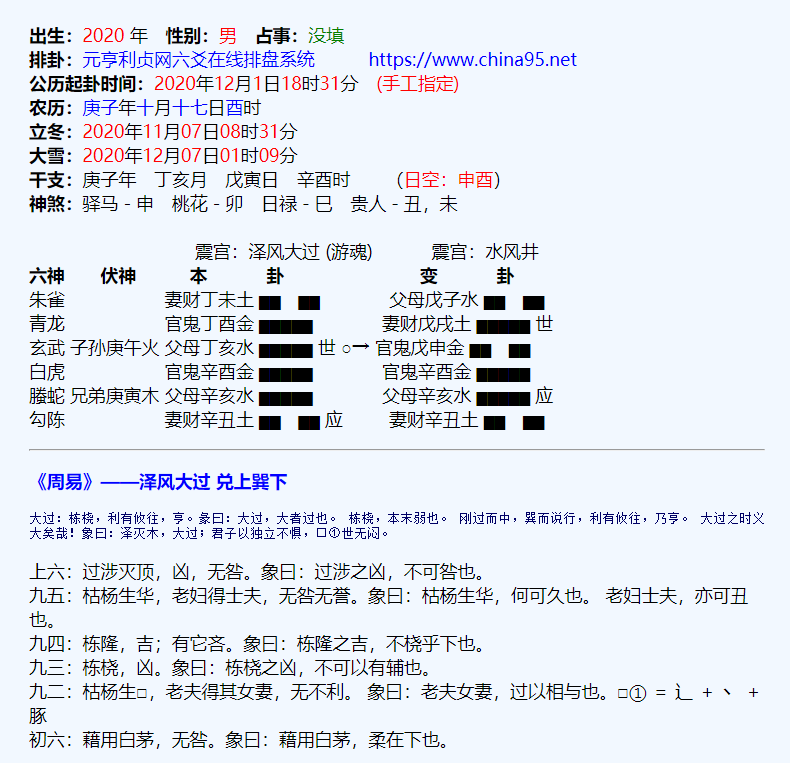

# 排盘系统

## 1. 卦象转换设计

1. ### 卦象的记录

   使用bit的方式 对应卦象 1为阳0位阴 开头1防止数据丢失

   ~~~js
   // 乾卦
   let qian = 1111111
   let qian = 1111
   // 坤卦
   let kun = 1000000
   ~~~

2. ### 五行的记录

   1. 规定八卦卦象对应五行
   2. 两个八卦重叠的卦就是对应五行

3. ### 宫位的对应（世应的对应）

   1. 确定八宫本宫
   2. 按位取反，判断该卦是否在宫内
   3. 根据对应的取反次数取世应
   4. 记录所属宫属
   5. 将数据拼接成新的json字符串；

4. ### 十二支的排列

   1. 根据所属宫位确定本位五行
   2. 创建地支数组，根据内外卦确定地支排列
   
5. ### 六亲的对应

   1. 根据（本位五行【本宫/本卦】）和十二支五行关系排六亲
   2. 检查是否六亲都有，没有标记出没有的飞神
      1. 找出宫属
      2. 找出不在卦上的六亲

6. ### 六神

   1. 根据起卦日辰确定六神

7. ### 神煞

   

8. ### 规则的判断（旬空、入墓、月破。。。）

   1. 旬空
      1. 本卦、变卦 所属十二支 是否在旬空内
   2. 生旺墓绝
      1. 建表，将记录信息录入
   3. 旺休囚
      1. 建表，将信息录入
   4. 月破
      1. 根据 月建 获得对应十二支
      2. 判断 变卦中是否有对应十二支
   5. 日冲/日破
      1. 根据 日辰 获得对应十二支
      2. 判断 变卦中是否有对应十二支
   6. 六冲
      1. 建表
         1. 判断是否是静卦六冲
   7. 六合
      1. 建表	
         1. 判断是否是静卦六合
   8. 三合
      1. 建表
         1. 判断 日、月、爻 是否有符合的
   9. 刑
      1. 建表
         1. 判断 
   10. 动变
       1. 根据 本卦、变卦 不同的位 获取对应的动爻、变爻

### 1. 64卦JSON串设计

~~~javascript
{
    （卦体）1000000：{
        卦名：地为坤
        五行：JIN
        上卦：000
        下卦：000
        宫属：{
            所属宫：QIAN
            第几世：1
            世爻：1
        }
        纳甲：{
            天干：[]
            地支：[]
        }
        六冲：ture
        六合：false
        伏神：[{火，1}]
    }
    
}
~~~

~~~java
java程序设计思路
    1. 
~~~

## 2.时间

1. 干支时间
2. 节气
3. 农历时间
4. 公历时间

## 3.前端数据的设计